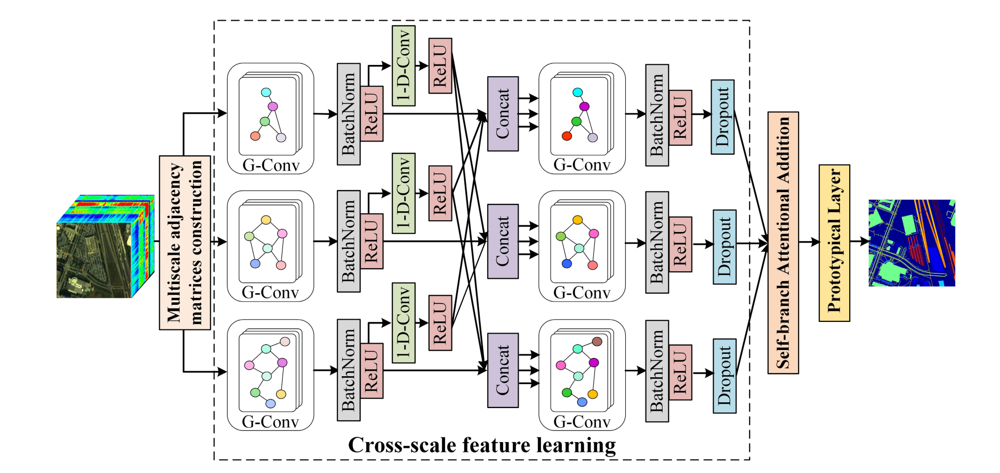

## Topic1-Hyperspectral image classification

<table width="100%" class="imgtable">
    <tr>
        <td width="306"> </td>
        <td>
            <a href="https://ieeexplore.ieee.org/stamp/stamp.jsp?tp=&arnumber=10285305">[9] Multiscale Change Detection Network based on Channel Attention and Fully Convolutional BiLSTM for Medium-resolution Remote Sensing Imagery</a>
             J. Li, <b>M. Hu</b>, and C. Wu,
             <i>IEEE Journal of Selected Topics in Applied Earth Observations and Remote Sensing (<b>JSTARS</b>)</i>, 2023. (<b>SCI Q3, IF=5.5</b>)
             [<a href="https://ieeexplore.ieee.org/stamp/stamp.jsp?tp=&arnumber=10285305">Paper</a>]
        </td>
    </tr>
</table>
 

### Few-shot classification

### Imbalance classification

### Semi-supervised classification

### Feature extraction

## Topic2-Multimodal classification

### Fusion classification

### Zero-shot scene classification