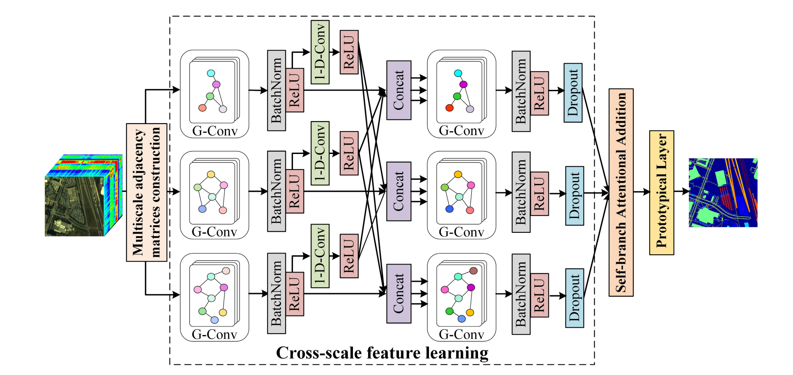

## Topic1-Hyperspectral image classification

### Few-shot classification

<table width="100%" class="imgtable">
    <tr>
        <td width="306"> </td>
        <td>
            <a href="https://ieeexplore.ieee.org/document/9841445">Few-shot Learning With Class-Covariance Metric for Hyperspectral Image Classificationc</a>
              <b>Bobo Xi<b>, Jiaojiao Li, Yunsong Li, Rui Song, Yuchao Xiao, Qian Du, Jocelyn Chanussot
             <i> IEEE Transactions on Image Processing, (<b>TIP</b>)</i>, 2022. (<b>SCI Q1 Top, IF=10.6</b>)
             [<a href="https://ieeexplore.ieee.org/document/9841445">Paper</a>][<a href="https://github.com/B-Xi/TIP_2022_CMFSL">Code</a>]
        </td>
    </tr>
</table>

### Imbalance classification

<table width="100%" class="imgtable">
    <tr>
        <td width="306"> </td>
        <td>
            <a href="https://ieeexplore.ieee.org/document/9841445">DGSSC: A Deep Generative Spectral-Spatial Classifier for Imbalanced Hyperspectral Imagery</a>
               <b>Bobo Xi<b>, Jiaojiao Li, Yan Diao, Yunsong Li, Zan Li, Yan Huang, Jocelyn Chanussot
             <i> IEEE Transactions on Image Processing, (<b>TIP</b>)</i>, 2022. (<b>SCI Q1 Top, IF=10.6</b>)
             [<a href="https://ieeexplore.ieee.org/document/9841445">Paper</a>][<a href="https://github.com/B-Xi/TIP_2022_CMFSL">Code</a>]
        </td>
    </tr>
</table>

### Semi-supervised classification

<table width="100%" class="imgtable">
    <tr>
        <td width="306"> </td>
        <td>
            <a href="https://ieeexplore.ieee.org/document/9740412">Semisupervised Cross-scale Graph Prototypical Network for Hyperspectral Image Classification</a>
              <b>Bobo Xi<b>, Jiaojiao Li, Yunsong Li, Rui Song, Yuchao Xiao, Qian Du, Jocelyn Chanussot,
             <i> IEEE Transactions on Neural Networks and Learning Systems, (<b>TNNLS</b>)</i>, 2023. (<b>SCI Q1 Top, IF=14.255</b>)
             [<a href="https://ieeexplore.ieee.org/document/9740412">Paper</a>][<a href="https://github.com/B-Xi/TNNLS_2022_X-GPN">Code</a>]
        </td>
    </tr>
</table>

### Feature extraction

## Topic2-Multimodal classification

### Fusion classification

### Zero-shot scene classification